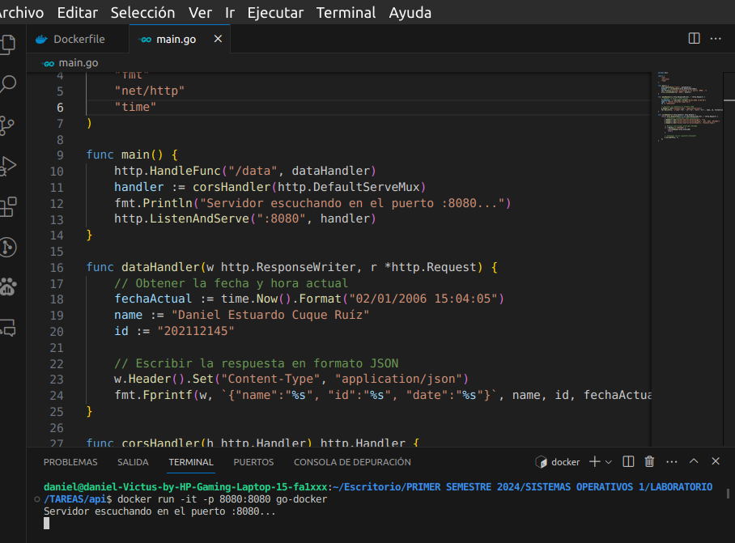
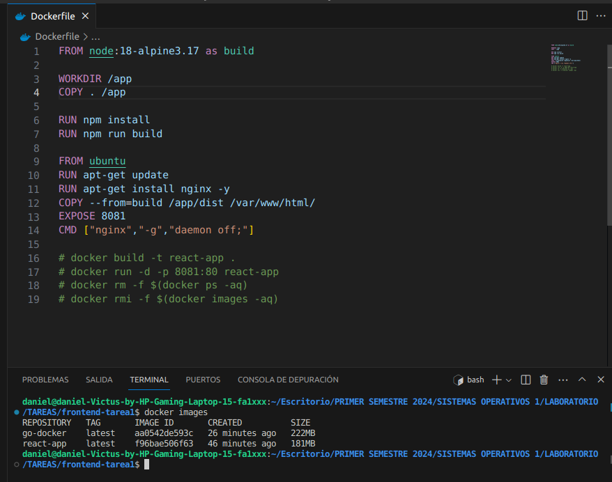
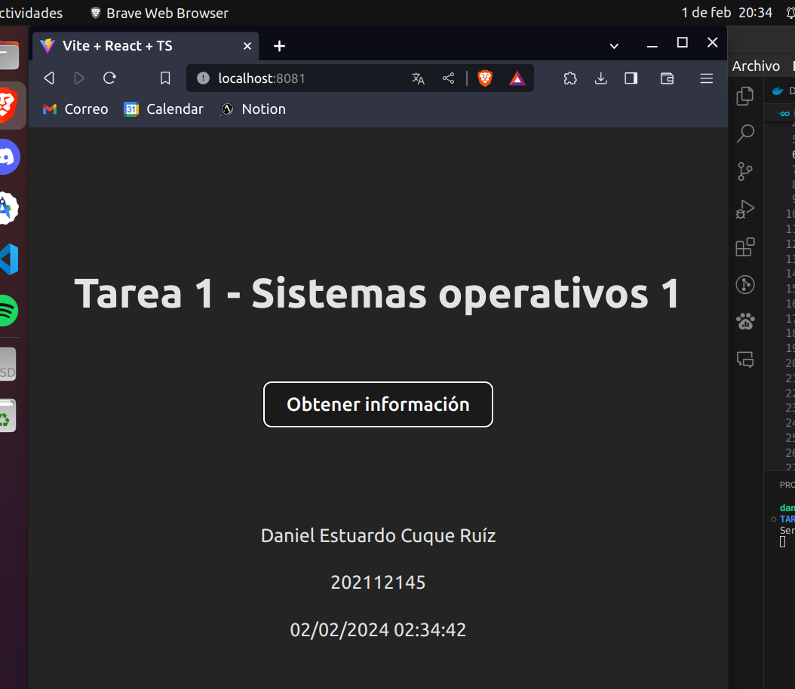

# Tarea 1

Dockerizar una aplicación web con React y Golang.

## Dockerfile para Golang

## Dockerfile para React

## Aplicación en ejecución

## Link al video

[Video](https://youtu.be/lNTlN8DGTik)